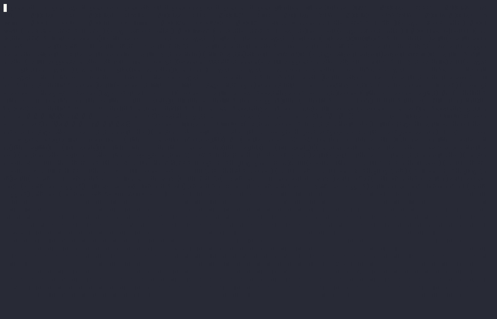

# ASCII Clock

<center>
<span>English Docs</span> | <a href="README.id.md">Indonesian Docs</a>
</center>

---

A real-time CLI clock that displays time by highlighting characters from its own source code to form ASCII art digits.



## Features

- **Self-Rendering**: Uses the program's own source code as the canvas for ASCII art
- **Real-Time Display**: Updates every second without terminal spam
- **Adaptive Sizing**: Automatically adjusts to terminal dimensions
- **Cross-Platform**: Supports Windows, macOS, and Linux
- **Color-Coded Time**: Hours, minutes, and seconds in distinct colors
- **Intelligent Spacing**: Improved character separation and border rendering

## Requirements

- Python 3.6+
- Terminal with ANSI color support
- Minimum terminal size: 100x25 characters

## Installation

Clone the repository:

```bash
git clone https://github.com/decryptable/ascii-clock.git
cd ascii-clock
```

## Usage

Run the clock:

```bash
python clock.py
```

Press <kbd>Ctrl+C</kbd> to exit.

## How It Works

ASCII Clock operates through a sophisticated multi-step process that transforms source code into a visual timepiece:

### 1. Source Code Processing
- **Self-Reading**: The program reads its own source file (`clock.py`) using Python's file I/O operations
- **Docstring Removal**: Uses regex patterns to strip all docstrings (both single and multi-line) and comments from the source code
- **Minification**: Removes excessive whitespace and empty lines to create a continuous stream of code characters
- **Buffer Extension**: Duplicates the minified code multiple times to ensure sufficient characters for the display grid

### 2. Dynamic Grid Creation
- **Terminal Detection**: Automatically detects current terminal dimensions using `os.get_terminal_size()`
- **Grid Mapping**: Creates a 2D character grid by mapping the minified source code sequentially across rows and columns
- **Adaptive Sizing**: Adjusts grid dimensions based on terminal size, ensuring optimal display on any screen

### 3. ASCII Art Generation
- **Pattern Matching**: Each digit (0-9) and colon (:) has a predefined 11×9 pixel pattern stored in `ASCII_PATTERNS`
- **Time Parsing**: Current system time is formatted as "HH:MM:SS" and each character is mapped to its corresponding pattern
- **Position Calculation**: Calculates exact grid coordinates for each pixel of every digit, centered in the terminal

### 4. Character Highlighting System
- **Pixel Mapping**: For each active pixel in the digit patterns, identifies the corresponding character in the source code grid
- **Color Assignment**: Applies distinct color schemes:
  - **Red**: Hours (HH)
  - **Green**: Minutes (MM) 
  - **Cyan**: Seconds (SS)
  - **Yellow**: Separators (:)
- **Border Detection**: Generates subtle gray borders around highlighted characters by identifying adjacent non-digit positions

### 5. Spacing Algorithm
- **Character Separation**: Implements 12-pixel horizontal spacing between digits to prevent visual overlap
- **Border Optimization**: Uses set operations to eliminate duplicate border positions and prevent conflicts with digit pixels
- **Centering Logic**: Dynamically calculates optimal positioning to center the time display within available terminal space

### 6. Real-Time Rendering Loop
- **Screen Management**: Clears terminal and repositions cursor for flicker-free updates
- **Layered Display**: Renders three visual layers:
  - **Background**: Dark gray source code characters
  - **Borders**: Light gray characters around time digits
  - **Foreground**: Brightly colored time digit characters
- **Timing Control**: Updates display every second with precise timing synchronization

## Platform Support

- **Windows**: Full support with terminal size detection
- **macOS/Linux**: Full support including auto-resize detection
- **Auto-Resize**: Automatically detects terminal resizing where supported

## Technical Details

- **Display Grid**: Dynamic grid creation based on terminal size
- **Pattern Matching**: 11x9 pixel ASCII patterns for each digit
- **Color Scheme**: Red (hours), green (minutes), cyan (seconds), yellow (separators)
- **Border Algorithm**: Smart border detection to prevent character overlap
- **Source Processing**: Regex-based docstring and comment removal for clean ASCII art

## Troubleshooting

**Terminal too small**: Resize your terminal to at least 100x25 characters.

**Colors not showing**: Ensure your terminal supports ANSI color codes.

**Auto-resize not working**: Some terminals or operating systems may not support automatic resize detection. Manual refresh may be needed after resizing.

---

**Author**: decryptable